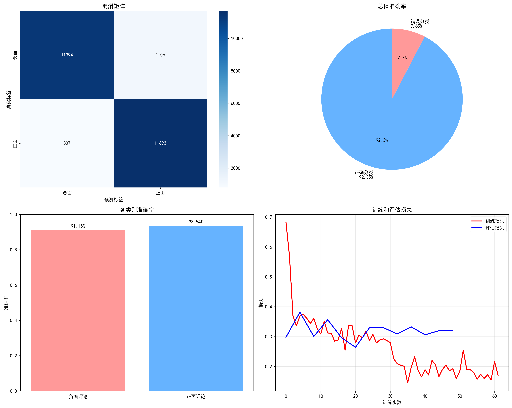

# _***BERT_IMDB by tassels***_

---
## 项目链接：https://github.com/Tasselszcx/BERT_IMDB

## 📖 项目概述
这是一个基于BERT模型的电影评论情感分析系统，能够自动识别IMDB电影评论的情感倾向（正面/负面）。项目从零开始，涵盖了环境配置、数据预处理、模型训练、评估测试到结果可视化的完整机器学习流程。

## 🎯 项目特点
- 使用先进的BERT预训练模型进行微调
- 在25,000条评论的完整IMDB数据集上训练
- 提供完整的可视化分析和模型评估
- 包含实时情感分析演示

## 🛠️ 项目依赖
- 深度学习框架: PyTorch 2.1.0 + CUDA 12.1
- 预训练模型: BERT-base-uncased
- 数据处理: Hugging Face Transformers & Datasets
- 可视化: Matplotlib & Seaborn
- 评估指标: Scikit-learn
- 开发环境: Jupyter Notebook + Conda
  
## 🚀 环境配置
### 1. 创建Conda虚拟环境
``` bash
conda create -n bert-imdb-gpu python=3.10
conda activate bert-imdb-gpu
```

### 2. 安装依赖包
``` bash
# PyTorch (CUDA 12.1)
pip install torch torchvision torchaudio --index-url https://download.pytorch.org/whl/cu121
# 项目核心依赖
pip install transformers[torch] datasets pandas numpy matplotlib seaborn scikit-learn tqdm jupyter
```

### 3. 启动jupyter notebook
```bash
jupyter notebook
```

## 🎮 运行项目
- 打开 bert_imdb.ipynb
- 按顺序运行所有单元格

## 📁 项目结构
- ├── bert_imdb.ipynb # 主项目文件
- ├── 📁 bert_imdb_final/ # 训练好的模型
- │ ├── config.json
- │ ├── special_tokens_map.json
- │ ├── tokenizer.json
- │ ├── training_args.bin
- │ ├── vicab.txt
- │ └── tokenizer_config.json
- ├── 📁 visualizations/ # 生成的图表
- │ └── bert_imdb_rtx4090_results.png
- │── requirements.txt # 项目依赖
- └── README.md # 项目说明
---

## bert_imdb.ipynb代码结构说明
- 单元格1: 环境检查和导入
- 单元格2: 加载IMDB电影评论数据集
- 单元格3: 加载BERT分词器, 将文本转换为BERT输入格式, 设置序列长度和填充
- 单元格4: 加载预训练的BERT模型
- 单元格5: 配置训练超参数, 设置评估和保存策略
- 单元格6: 定义评估指标函数, 创建Trainer实例
- 单元格7: 开始BERT模型微调, 显示训练进度和损失, 记录训练时间
- 单元格8: 在测试集上评估模型性能, 生成详细分类报告, 保存训练好的模型
- 单元格9: 绘制混淆矩阵, 显示准确率分布, 可视化训练过程
- 单元格10: 使用训练好的模型分析新评论， 演示模型实际应用
- 单元格11: 计算详细性能指标， 分析各类别准确率
   

